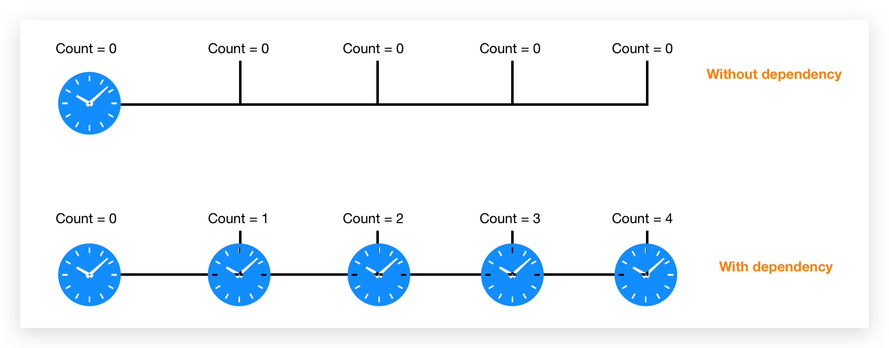

## Case 1: miss dependency in useEffect
- 因为`没有依赖`，是无法触发页面的`unmount`和`componentDidUpdate`的, 只会在`componentDidMount`时运行一次
- 同样的值传入`setState`多次，只有**前两次**会引起re-render;
- 为什么`count`的值一直是`0`？
  - 每次渲染都是一次`snapshot`，会有自己`state`的一个`version`
  - 因为`没有依赖`，所以就没有`unmount`的发生，所以`clean`不会发生
  - `clean`没有发生，全局就`只`有一次`setInterval`,会把count`闭包`闭进去
  - 闭包是闭了`count`这个`变量`，而`不是`它的`值`
  - 但是`count`这个变量`永远停留`在当时渲染的那个`状态`(Immutable)
  - 所以`setInterval`中读到的`count`永远都是`0`.
```javascript
import React, { useState, useEffect } from 'react';

const Counter = () => {
  const [count, setCount] = useState(0);
  console.log('render');

  useEffect(() => {
    console.log('componentDidUpdate')

    const id = setInterval(() => {
      console.log(count)
      setCount(count + 1)
    }, 1000);

    return () => {
      clearInterval(id); // 只会在页面退出时执行
      console.log('clean');
    }
  }, []); // 是无法触发页面的unmount和componentDidUpdate的, 只会在componentDidMount时运行一次
  return (
    <h1>
      {count}
    </h1>
  )
}
```


### Solution 1: append dependency
- 如果传入`count`，会发生什么?
  - 因为设置了`count`为`dependency`, 每次`count`的变动都会引起`unmount`, `re-render`和`useEffect`
  - 即clean上一次`setInterval`, 重新渲染(更新`count`的值), 和重新`setInterval`(闭包闭了新的`count`)
  - 因此`表现起来`会很正常
- 传入useEffect的dependencies:
  - state: 如果useEffect中又会引起state的变化，将会陷入无限循环当中
  - function:
    - 如果`function`定义在`useEffect`里面，则无需添加到依赖中
    - 如果`function`定义在`component`里面，将会陷入无限循环的渲染当中, 因为`function`每次渲染-引用都会发生变化
    - 如果`function`定义在`component`外面，则只会渲染一次
    - 如果必须把`function`定义在`component`里面，但是又不想无限循环，则在使用`useCallback`或者`useMemo`
```javascript
import React, { useState, useEffect } from 'react';
const Counter = () => {
  const [count, setCount] = useState(0);
  console.log('render');

  useEffect(() => {
    console.log('componentDidUpdate')

    const id = setInterval(() => {
      console.log(count)
      setCount(count + 1)
    }, 1000);

    return () => {
      clearInterval(id);
      console.log('clean');
    }
  }, [count]); // 每次变化将会触发unmount和componentDidUpdate

  return (
    <h1>
      {count}
    </h1>
  )
}

export default Counter;
```
<div style="text-align:center; margin:auto"></div>

### Solution 2: remove dependency
- `Solution 1`有什么问题?
  - 按照直觉，状态的更新引起页面的重新渲染我们可以理解
  - 但是状态的更新却同时引起了页面的`unmount`和`componentDidUpdate`, 其实是没有必要的过程
  - 我们希望只有一个`setInterval`，但是页面依然会根据状态变化而重新熏染
#### Solution A: 使用setState的函数模式
```javascript
import React, { useState, useEffect } from 'react';

const Counter = () => {
  const [count, setCount] = useState(0);
  console.log('render');

  useEffect(() => {
    console.log('componentDidUpdate')

    const id = setInterval(() => {
      setCount(count => count + 1); // 仅仅描述了一种行为，每次执行时都会自动读取当时最新count值
    }, 1000);

    return () => {
      clearInterval(id);
      console.log('clean');
    }
  }, []); // 是无法触发页面的unmount和componentDidUpdate的

  return (
    <h1>
      {count}
    </h1>
  )
}

export default Counter;
```

#### Solution B: 使用`useReducer`
- 这种情况适用于: state相互之间存在依赖，需要传入多个进入`useEffect`的`dependency`
- 建议: 能把`initialState`和`reducer`都放在`component`外面的，就尽量放在外面
- 因为每次渲染都会形成新的`initialState`和`reducer`, 是没有必要的
- 你会发现这里`state`的变化也不会引起`unmount`的发生
```javascript
import React, { useEffect, useReducer } from 'react';

const initialState = { count: 0, step: 1 };
const reducer = (state, action) => {
  switch (action.type) {
    case 'TICK': return { ...state, 
      count: state.count + state.step };
    case 'STEP': return { ...state, 
      count: state.count + state.step + action.payload, 
      step: state.step + action.payload }
    default: throw new Error();
  }
}

const Counter = () => {
  const [state, dispatch] = useReducer(reducer, initialState);

  console.log('render');
  useEffect(() => {
    console.log('componentDidUpdate')
    const id = setInterval(() => {
      dispatch({ type: 'TICK' }); // 读取上一次最新的state交给了userReducer去完成
    }, 1000);
    return () => {
      clearInterval(id);
      console.log('clean');
    }
  }, []); // 是无法触发页面的unmount和componentDidUpdate的

  return (
    <h1>
      {state.count} <br/>
      <button onClick={() => { dispatch({ type: 'STEP', payload: 1 }) }}>Step Up</button>
    </h1>
  )
}

export default Counter;
```
## case 2: compute state based on props
### Solution 1: pass props to dispatch
- 这种情形跟`case 1`类似: 
  - 如果**不将**`step`例如`dependency`, 那么不会触发`unmount`, `setInterval`全局只有**一**个，闭包闭的`step`的值一直停留在最初的值上面，因为`props`的变化并**不**能引起`count`的变化
  - 如果**将**`step`列入`dependency`, 将会触发`unmount`, `setInterval`一直会`clean`和`重建`，读取到的props也是最新的，但是有`一定性能的损耗`.
```javascript
import React, { useEffect, useReducer } from 'react';

const initialState = { count: 0 };
const reducer = (state, action) => {
  switch (action.type) {
    case 'TICK': return { ...state, count: state.count + action.step };
    default: throw new Error();
  }
}

const Counter = (props: any) => {
  const { step } = props;
  const [state, dispatch] = useReducer(reducer, initialState);

  console.log('render');
  useEffect(() => {
    console.log('componentDidUpdate')
    const id = setInterval(() => {
      dispatch({ type: 'TICK', step }); // 读取上一次最新的state交给了userReducer去完成
    }, 1000);
    return () => {
      clearInterval(id);
      console.log('clean');
    }
  }, [step]); // react 保证dispatch在每次渲染中都是一样的

  return (
    <h1>
      {state.count} <br />
      {/* <button onClick={() => { dispatch({ type: 'STEP', payload: step }) }}>Step Up</button> */}
    </h1>
  )
}

export default Counter;
```
### Solution 2: move reducer inside component
- 因为`dependency`为`[]`, 因此全局只有一个`setInterval`
- `props`的更新本身就会引起`重新渲染`，因此`reducer`里面读到的永远是最新的`props`
```javascript
import React, { useEffect, useReducer } from 'react';

const initialState = { count: 0 };

const Counter = (props: any) => {
  const { step } = props;

  const reducer = (state, action) => {
    switch (action.type) {
      case 'TICK': return { ...state, count: state.count + step };
      default: throw new Error();
    }
  }
  const [state, dispatch] = useReducer(reducer, initialState);

  console.log('render');
  useEffect(() => {
    console.log('componentDidUpdate')
    const id = setInterval(() => {
      dispatch({ type: 'TICK' }); 
    }, 1000);
    return () => {
      clearInterval(id);
      console.log('clean');
    }
  }, []); 

  return (
    <h1>
      {state.count} <br />
    </h1>
  )
}

export default Counter;
```

## case 3: put function outside of effect
- 特征: 
  - `函数`本身的**值**不会发生变化(**stable**)
  - 函数本身`未引用`任何外部**变量**,
- `useEffect`中引用`外部`的**变量**(**仅仅是变量不包括函数**)会`被提醒`要加入到`dependency`中
- 所以这里的`fetchData`并**未**被要求加入到`dep`s中
- 因为`fetchData`定义是在`component`内部，`useEffect`的外部，如果加入到`dep`s中，一定会引起页面的**无限刷新**
```javascript
import React, { useState, useEffect } from 'react';
import axios from 'axios';

const SearchResult = () => {

  const [data, setData] = useState({ hits: [] });

  const fetchData = async () => {
    const result = await axios('https://hn.algolia.com/api/v1/search?query=react')
    setData(result.data);
  }

  useEffect(() => {
    // 将fetchData放到这里其实效果一样，性能也基本上没有差异
    fetchData(); // 未引用任何变量，所以不会被提醒加入到deps中
  }, []) // 如果把函数加入到deps中，反而会造成页面的无限循环
  return (
    <div>{data.hits.map((item: any) => (
      <div>{item.title}</div>
    ))}</div>
  )
}

export default SearchResult;
```
## case 4: function references any external variables
### Solution : put function inside useEffect with variable as deps in useEffect
```javascript
import React, { useState, useEffect } from 'react';
import axios from 'axios';

const SearchResult = () => {
  const [query, setQuery] = useState('react');
  const [data, setData] = useState({ hits: [] });

  useEffect(() => {
    const fetchData = async () => { // define inside useEffect
      const result = await axios('https://hn.algolia.com/api/v1/search?query='+ query);
      setData(result.data);
    }
    fetchData();
  }, [query]) // add external variables here
  return (

    <div>
      <ul>
        {data.hits.map((item: any) => (
          <li key={item.objectID}>{item.title}</li>
        ))}
      </ul>
      {query}
    </div>
  )
}

export default SearchResult;
```
## case 5: function references any external variables but is used by multiple useEffects
### Solution: `useCallback`
- 特征:
  - 如果有一个函数必须放到useEffect之外，例如想要在多个useEffect中复用这个函数
  - 该函数要依赖外部变量时
- 解决:
  - useCallback的使用能够使得函数在每次页面渲染时候保持稳定，因此不会引起页面的再次渲染
  - useCallback的本质其实是将原本定义在useEffect中的函数分离出来的一层，最终还是依赖于变量的
- 问题:
  - 只是'缓存'了变量，并未缓存api请求的结果，可以进一步优化
```javascript
import React, { useState, useEffect, useCallback } from 'react';
import axios from 'axios';

const SearchResult = () => {
  const [query, setQuery] = useState('react');
  const [data1, setData1] = useState({ hits: [] });
  const [data2, setData2] = useState({ hits: [] });

  const MemorizedGetFetchUrl = useCallback(() => 'https://hn.algolia.com/api/v1/search?query=' + query, [query]);

  useEffect(() => {
    const fetchData = async () => {
      const result = await axios(MemorizedGetFetchUrl());
      setData1(result.data);
    }
    fetchData();
  }, [MemorizedGetFetchUrl])


  useEffect(() => {
    const fetchData = async () => {
      const result = await axios(MemorizedGetFetchUrl())
      setData2(result.data);
    }
    fetchData()
  }, [MemorizedGetFetchUrl])

  return (
    <div>
      <ul>
        {data1.hits.map((item: any) => (
          <li key={item.objectID}>{item.title}</li>
        ))}
      </ul>

      <br />
      <ul>
        {data2.hits.map((item: any) => (
          <li key={item.objectID}>{item.title}</li>
        ))}
      </ul>
    </div>
  )
}

export default SearchResult;
```
### Optimization: `useCallback`
- 缓存也api请求的结果，能够提高性能
- 当然如果页面unmount在mount, 缓存消失，会重新进行请求，如果还想优化，要考虑全局状态管理
```javascript
import React, { useState, useEffect, useCallback } from 'react';
import axios from 'axios';

const SearchResult = () => {
  const [query1, setQuery1] = useState('react');
  const [query2, setQuery2] = useState('redux');
  const [refresh, setRefresh] = useState(0)
  const [data1, setData1] = useState({ hits: [] });
  const [data2, setData2] = useState({ hits: [] });

  const MemorizedGetFetchUrl = useCallback((query, id) => {
    const fetchData = async () => {
      const result = await axios('https://hn.algolia.com/api/v1/search?query=' + query);
      if (id === 1) setData1(result.data);
      if (id === 2) setData2(result.data);
    }
    fetchData()
  }, []);


  useEffect(() => {
    MemorizedGetFetchUrl(query1, 1);
  }, [MemorizedGetFetchUrl, query1])


  useEffect(() => {
    MemorizedGetFetchUrl(query2, 2);
  }, [MemorizedGetFetchUrl, query2])

  return (
    <div>
      <ul>
        {data1.hits.map((item: any) => (
          <li key={item.objectID}>{item.title}</li>
        ))}
      </ul>

      <br />
      <ul>
        {data2.hits.map((item: any) => (
          <li key={item.objectID}>{item.title}</li>
        ))}
      </ul>
      <button onClick={() => { setRefresh(refresh + 1) }}>Re-render Page</button>
    </div>
  )
}

export default SearchResult;
```

## Case 6: clean up last api influence to avoid `Race Condition`
- 何时需要`cleanup`函数?
  - useEffect存在`deps`且`deps`会**变化**的时候
  - 例如在`useEffect`中的api请求依赖于某个`变量`。
    - **因为无法保证api请求的返回顺序**，我们需要在新的请求之前，**禁止上一次请求的结果对页面元素产生影响**！
- 代码分析:
  - 本质原因是js的`闭包`，闭包**闭的variable而不是值**
  - 因此在第一次`useEffect`执行未完成，但是`unmount`已经触发的情况下，第一次·的值会被修改为·
  - 这时候`setData`的操作就不会被出发
```javascript
const SearchResult = () => {
  const [query, setQuery] = useState('');
  const [search, setSearch] = useState('')
  const [data, setData] = useState({ hits: [] });

  const MemorizedGetFetchUrl = useCallback((didCancel) => {
    const fetchData = async () => {
      const result = await axios('https://hn.algolia.com/api/v1/search?query=' + search);
      !didCancel && setData(result.data); 
      !!didCancel && console.log('cancel setting result');
    }
    search !== '' && fetchData()
  }, [search]);


  useEffect(() => {
    let didCancel = false;
    !didCancel && MemorizedGetFetchUrl(didCancel);
    return () => {
      didCancel = true;
    }
  }, [MemorizedGetFetchUrl])

  return (
    <div>
      <ul>
        {data.hits.map((item: any) => (
          <li key={item.objectID}>{item.title}</li>
        ))}
      </ul>
      <input type="text" value={query} onChange={evt => setQuery(evt.target.value)} />
      <button onClick={() => setSearch(query)}>Search</button>
    </div>
  )
}
export default SearchResult;
```

## Case 7: how to choose between useMemo and useCallback
- `useCallback`可以直接传**参数**，而`useMemo`**不**能`直接`传**参数**, 但是二者都可以直接读取定义在文件内的`变量`
- `useMemo`重点在与缓存了函数运行的**结果**，而`useCallback`的重点在于缓存了**函数本身**，因此前者**不允许**传`参`，只用`deps`; 而后者**允许**设置`参数`，同时保持`deps`
- `useCallback`中可以进行`api`请求，而`useMemo`内部传入函数时只适合做用在`渲染过程`中的**昂贵计算**上,比如**重交互的图表**和**动画**等
- `useCallback(fn,deps)` = `useMemo(() => fn, deps)`

## Summary
- `useEffect`依赖的变动会引起
  - `unmount`
  - `render`
  - `componentDidUpdate`
- 什么会引起`componentWillUnmount`?
  - 页面`退出`
  - `useEffect`中`依赖值`的变动
- setState会引起什么？
  - `render`
  - `componentDidUpdate`
  - **不会**引起`unmount`
- props的改变会引起什么?
  - 子组件的`render`
  - 子组件的`componentDidUpdate`
  - **不会**引起`unmount`
- 为什么要减少dependency?
  - 为了减少dependency变化带来的`componentWillUnmount`的执行
- useEffect会提醒你把什么东西加入到deps中?
  - **外部变量**
  - 包含**外部变量**的`函数`
  - **不提醒**你把**不包含外部变量**的`函数`加入
- 什么样的变量适合放入`state`中?
  - 用来**沟通**`html`和`js`的变量
- 定义在`hooks`之外，组件之内的变量和函数有什么特征?
  - 在每次渲染后，`引用`都会发生**改变**
- 经验之谈：
  - 放在`deps`里面的不是`props`就是`state`
  - 因为`component`中的`hooks`之外的变量和函数都是不稳定的，会引起**无限渲染**
  - 如果要放在`component`之外，说明不需要被复用，其实可以直接放入到`hooks`里面
  - 如果没办法放在component之内，有必须在hooks之外的(复用)，则需要使用`useCallback`, `useMemo`来原始化
- 本质: hooks的本质就是在immutable中使用mutable

## References
- [A Complete Guide to useEffect](https://overreacted.io/a-complete-guide-to-useeffect/)
- [什么时候使用 useMemo 和 useCallback](https://jancat.github.io/post/2019/translation-usememo-and-usecallback/)